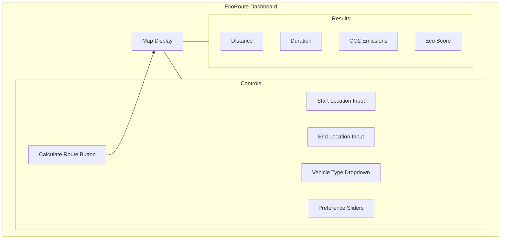

# EcoRoute: Frontend Dashboard Design

This document outlines the design for the frontend dashboard, a simple web interface to demonstrate the capabilities of the EcoRoute API.

## 1. Overview

The frontend will be a single-page application built with HTML, CSS, and vanilla JavaScript. It will provide a user-friendly interface for inputting start and end locations, selecting preferences, and visualizing the calculated eco-friendly route on a map.

The files will be located in the `frontend/` directory as specified in the `project_structure.md`.

## 2. Key Components

### a. Map Display
-   **Library**: We will use an open-source mapping library like [Leaflet.js](https://leafletjs.com/) to display the interactive map.
-   **Functionality**:
    -   The map will be the central element of the UI.
    -   It will display the calculated route as a polyline.
    -   Markers will indicate the start and end points.
    -   EV charging stations could be displayed as optional markers.

### b. Input Form
-   **Location Inputs**: Two text fields for the user to enter the start and end locations (or they can click on the map).
-   **Vehicle Type**: A dropdown menu to select the vehicle type (e.g., "EV", "Hybrid", "ICE-Petrol").
-   **Preference Sliders**: A set of sliders for the user to adjust the weights (`w1` to `w5`) of the eco-cost function, allowing them to prioritize factors like CO₂ savings, time, or distance.
-   **Submit Button**: A "Calculate Eco Route" button to trigger the API call.

### c. Results Display
-   A dedicated section to display the results returned by the API:
    -   **Distance**: Total route distance in kilometers.
    -   **Duration**: Estimated travel time in minutes.
    -   **CO₂ Emissions**: Estimated CO₂ savings in kilograms.
    -   **Eco Score**: The calculated eco-driving score.

## 3. User Workflow

1.  The user opens the `index.html` page.
2.  They enter their start and end locations in the input form.
3.  They select their vehicle type and adjust the preference sliders.
4.  They click the "Calculate Eco Route" button.
5.  The JavaScript in `app.js` constructs a `RouteRequest` object and sends a `POST` request to the backend API (`/api/v1/route`).
6.  While waiting for the response, a loading indicator is displayed.
7.  Upon receiving the `RouteResponse`, the JavaScript parses the data.
8.  The route geometry is drawn on the Leaflet map.
9.  The calculated statistics (distance, duration, etc.) are displayed in the results section.

## 4. Wireframe (Mermaid Diagram)

Here is a simple wireframe illustrating the layout of the dashboard:

## 5. Implementation Details (`app.js`)

-   The `app.js` file will contain the core logic.
-   It will initialize the Leaflet map.
-   It will have an event listener for the form submission.
-   It will use the `fetch()` API to communicate with the backend.
-   It will include functions to clear previous routes and draw new ones on the map.